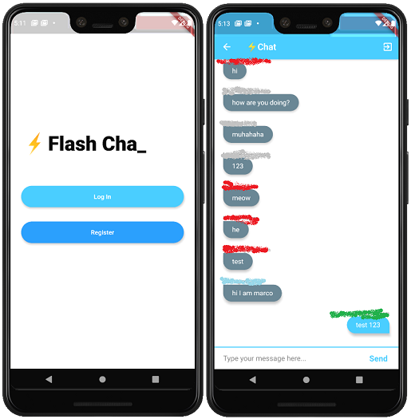

Flutter-Chatroom-app
==
This repository is a text-only chatroom apllication created using Flutter with firebase cloud. It supports email/password login and Google logins through firebase authentication. Once the user is registered, the user is able to post messages in the chatroom that can only access by all the registered users.

## Dependencies
```yaml
dependencies:
  animated_text_kit: ^1.3.1
  firebase_core: ^0.4.0+9
  firebase_auth: ^0.14.0+5
  modal_progress_hud: ^0.1.3
  cloud_firestore: ^0.12.9+6
  flutter_signin_button: ^1.0.0
  google_sign_in: ^3.2.2
```

## Versioning
Version 1.0 (First deployment)
## Screenshot



## To do list
* Warning and fallback methods for failed login as wrong password or invalid username. (Currently it will stuck on spinner.)
*  Firebase authentication with Facebook.
* User settings

## License

The contents of this repository are covered under the [MIT](LICENSE) License.

## Acknowledgments
Angela Yu's [Flutter Development Course](https://www.appbrewery.co/p/flutter-development-bootcamp-with-dart).
Souvik Biswas's [sign_in_flutter repository](https://github.com/sbis04/sign_in_flutter).
